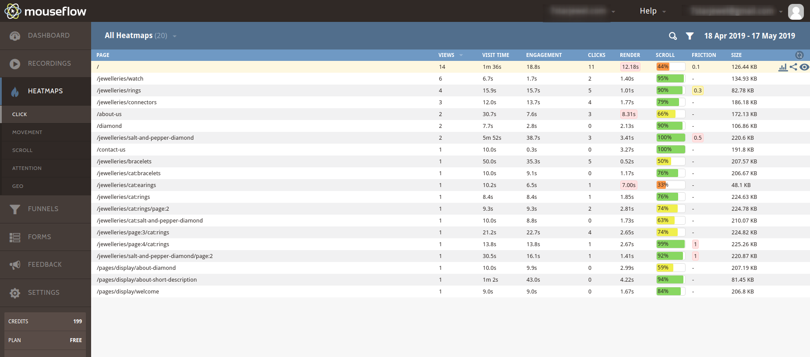

# Vue Storefront Mouseflow module
[Mouseflow](https://www.mouseflow.com) integration for [vue-storefront](https://github.com/DivanteLtd/vue-storefront), by [Chirag Viradiya](https://www.develodesign.co.uk).
<br />Mouseflow account required (free trial is available)
<br /><br />
Intergration with the Mouseflow you can easily track your website for your Vue Storefront, this Mouseflow module is configured to track your custom actions with your website, this allows you to accurately help you to judge marketing way, knowing which page got more hit.
<br /><br />


## Installation:

### 1. Clone the repository

Clone the vsf-mouseflow repository into your VSF installation.
```shell
$ git clone git@github.com:cnviradiya/vsf-mouseflow.git vue-storefront/src/modules/mouseflow
```

### 2. Add the module config to your local VSF configuration file.
Add the following JSON config snippet into your desired config, eg. `config/local.json`
```json
"mouseflow": {
  "website_id": false,
  "cross_domain": true
}
```
Replace the `website_id` parameter with the Website ID provided by Mouseflow. You can find your Mouseflow Website ID here: http://help.mouseflow.com/knowledge_base/topics/how-do-i-find-my-mouseflow-site-id. Setting `website_id` to `false` will disable the mouseflow module at runtime.
<br />
Valid website_id example: `"website_id": "12345678-abcd-1234-abcd-1234567890ab"`

Here also available option to track your cross domains with different or same urls, you just need to configure in `config/local.json`. You can find more detail about cross domain tracking with mouseflow here: http://help.mouseflow.com/knowledge_base/topics/cross-domain-tracking. Setting `cross_domain` to `false` will disabled cross domain tracking with mouseflow.
<br />
Enable cross domain: `"cross_domain": true`
Disable cross domain: `"cross_domain": false`


### 3. Register the Mouseflow module
Open up your `../vue-storefront/src/modules/index.ts` and add the following code. Adding it inside this file the registers the module so it can be used in your Vue Storefront.
<br />
```js
import { Mouseflow } from './mouseflow'
...
export const registerModules: VueStorefrontModule[] = [
...
Mouseflow
...
]
```
### 3. Enjoy!
Thats it! It's easy, plug and play! If you havn't got an Mouseflow account already, you can create one here, there is free tier that you can use to get started: https://www.mouseflow.com/pricing

## Customization
#### Replacing the Mouseflow Script.
If you need to change the Mouseflow script that is loaded on the page, open up the `./mouseflow/hooks/afterRegistration.ts` file. On line 40 you'll find the script provided from Mouseflow, you can swap this out or extend it as required.
